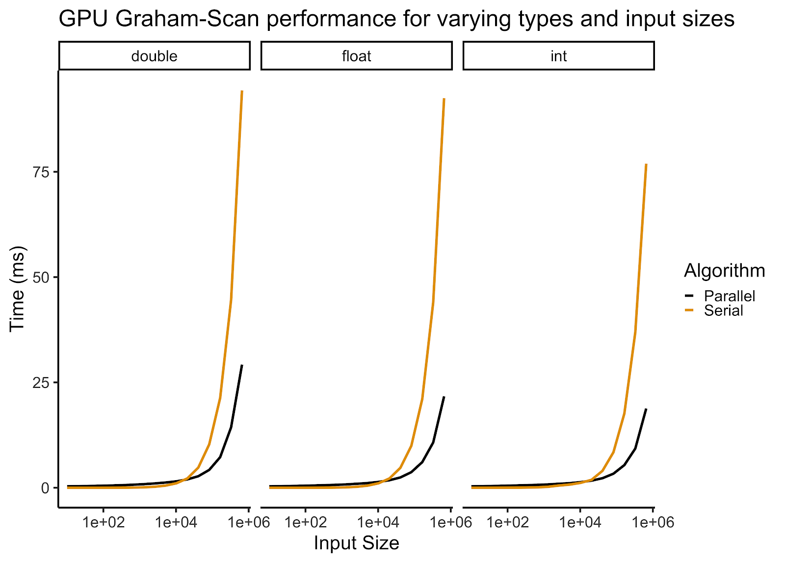

# gpuGrahamScan
A GPU accelerated Graham-Scan implementation. 

## Description:
The vast majority Graham-Scan's run time is can be attributed to sorting since finding the hull after points are sorted is only on O(n) operation.  Thus, we decided to speed up the algorithm by doing the sorting on a GPU, using Bitonic Sort. Although Bitonic Sort has a runtime of O(nlog^2(n)), it requires very little logic and is, therefore, more readily parallelizable than classical CPU sorting algorithms like Merge Sort and QuickSort, which run in O(nlog(n)) [2]. To implement Bitonic Sort on the GPU, we recognized that each thread could be assigned two indices of our array of points.  The only logical operation that is required of these threads is to check whether one point is to the right of another point with respect to our bottom-leftmost point in the array, which is an O(1) operation.  Thus, we could simply use thread and block id’s to map threads to indices of arrays and ensured coherence within blocks by assigning contiguous chunks of indices to thread blocks.

## Performance

Note that in the figure above, run time was calculated to be the minumum run time of 5 consecutive runs. For large input sizes we see a large speed up over the serial implementation across data types. For small input sizes the serial implementation is faster than the parallel implementation because of the latency of copying data onto the GPU. Therefore, in a generalized algorithm, it would be advantageous to implement control flow between parallel and serial implementations based on this threshold. We also saw that for large input sizes, we were getting 80% of the speed up we would gain from not sorting at all. While that would not be a correct approach, it does give us a sense on the lower bound of runtime for our parallel implementation.

## Requirements
- A NVIDIA GPU with support for 1024 threads per block 
- CUDA compiler/toolkit.

## References:
- [1]: Cormen, Thomas H.; Leiserson, Charles E.; Rivest, Ronald L.; Stein, Clifford (2009) [1990]. Introduction to Algorithms (3rd ed.). MIT Press and McGraw-Hill. ISBN 0-262-03384-4. 

- [2]: Wikipedia contributors. (2020, May 11). Bitonic sorter. In Wikipedia, The Free Encyclopedia. Retrieved 20:41, May 13, 2020, from https://en.wikipedia.org/w/index.php?title=Bitonic_sorter&oldid=956130960
